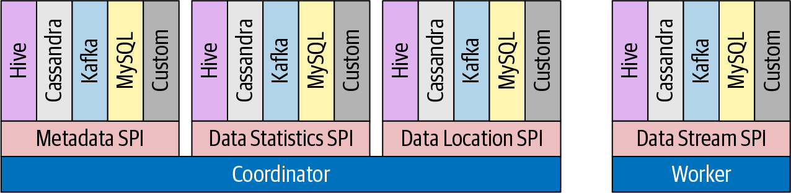
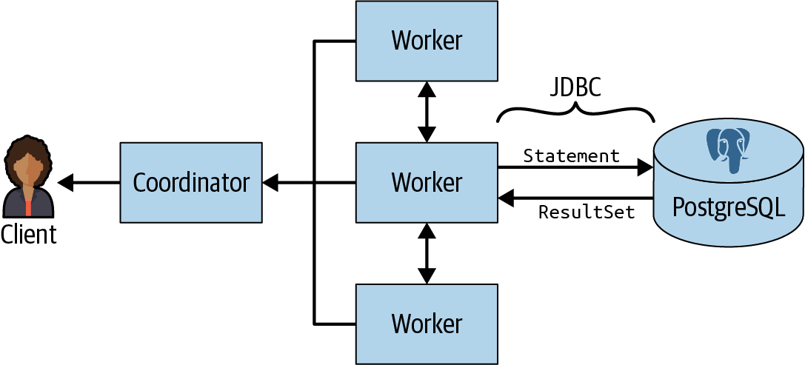

# Trino

## Overview

<p float="left">
    
    
</p>

* When organizations find the need to better understand and analyze data in their numerous RDBMSs, the creation and maintenance of `data warehouse` systems comes into play. Select data from various systems is then going through complex `ETL processes` and, often via long-running `batch jobs`, ends up in a tightly controlled, massive data warehouse.
* Trino, on the other hand, can be used as a `virtual data warehouse`. It can be used to define your semantic layer by using one tool and standard ANSI SQL. Once all the databases are configured as `data sources` in Trino, you can query them. This allows Trino to `scale up and down its compute resources` for query processing, based on analytics demand to access this data. 
* Trino represents the `compute layer`, whereas the underlying `data sources` represent the `storage layer`.

## Installation

1. Download `trino-server` from https://repo.maven.apache.org/maven2/io/trino/trino-server/:
```bash
wget https://repo.maven.apache.org/maven2/io/trino/trino-server/390/trino-server-390.tar.gz
tar xvzf trino-server-390.tar.gz
```

2. Check whether the `etc` folder contains the following configurations: `jvm.config`, `config.properties`, `node.properties` and `catalog/tpch.properties`. References are [Deploying Trino](https://trino.io/docs/current/installation/deployment.html) and [TPCH connector](https://trino.io/docs/current/connector/tpch.html).

3. Check whether `java -version` is above `17`.

4. Start `trino-server`:
```bash
/bin/launcher run
```

5. Download `trino-cli` from https://repo.maven.apache.org/maven2/io/trino/trino-cli/:
```bash
wget -O trino https://repo.maven.apache.org/maven2/io/trino/trino-cli/390/trino-cli-390-executable.jar

chmod +x trino
mv trino /usr/local/bin

trino --version
Trino CLI 390

trino
trino> SHOW CATALOGS;
 Catalog 
---------
 system  
 tpch    
(2 rows)

trino> SHOW SCHEMAS FROM tpch;
       Schema       
--------------------
 information_schema 
 sf1                
 sf100              
 sf1000
 
trino> SHOW TABLES FROM tpch.sf1;
 Table   
----------
 customer 
 lineitem 
 nation   
 orders  
 
trino --catalog tpch --schema sf1 --execute "SELECT nationkey, name, regionkey FROM nation LIMIT 5"
"0","ALGERIA","0"
"1","ARGENTINA","1"
"2","BRAZIL","1"
"3","CANADA","1"
"4","EGYPT","4"

trino> ANALYZE tpch.sf1.nation;
trino> SHOW STATS FOR tpch.sf1.nation;
 column_name | data_size | distinct_values_count | nulls_fraction | row_count | low_value | high_value 
-------------+-----------+-----------------------+----------------+-----------+-----------+------------
 nationkey   |      NULL |                  25.0 |            0.0 |      NULL | 0         | 24         
 name        |     177.0 |                  25.0 |            0.0 |      NULL | NULL      | NULL       
 regionkey   |      NULL |                   5.0 |            0.0 |      NULL | 0         | 4          
 comment     |    1857.0 |                  25.0 |            0.0 |      NULL | NULL      | NULL       
 NULL        |      NULL |                  NULL |           NULL |      25.0 | NULL      | NULL       
(5 rows)

Query 20220715_192148_00014_miptg, FINISHED, 1 node
Splits: 1 total, 1 done (100,00%)
0,12 [0 rows, 0B] [0 rows/s, 0B/s]
```

6. View the `trino` web UI from http://localhost:8080/ui/.

## Architecture

<p float="left">
    
    
</p>

* All communication and data transfer between clients, coordinator, and workers uses `REST-based` interactions over `HTTP`/`HTTPS`.
* The `discovery service` typically runs on the coordinator and allows workers to register to participate in the cluster.
* A `Trino worker` is a `server` in a Trino installation. It is responsible for executing tasks assigned by the coordinator and for processing data. Worker nodes `fetch data from data sources` by using `connectors` and then exchange intermediate data with each other. 
* At the heart of the separation of storage and compute in Trino is the `connector-based architecture`. Each connector provides a `table-based` abstraction over the underlying data source. 
* The `data location SPI` is then facilitated in the creation of the `distributed query plan`. It is used to generate `logical splits` of the table contents. Splits are the smallest unit of work assignment and `parallelism`.
* `CPU time`, `memory` requirements, and `network bandwidth` usage are the three dimensions that contribute to query execution time, both in single-query and concurrent workloads. These dimensions constitute the cost in Trino.
* It is important to note that `Trino stores statistics` in the `Hive metastore`, the same place that Hive uses to store statistics. 

## Connectors

### Postgresql

* `filter` and `column projections` can be pushed down to PostgreSQL.
* `aggregations` are not pushed down to PostgreSQL. If you do want to push additional processing down to the underlying RDBMS source, you can accomplish this by using `views`, e.g., `CREATE VIEW xxx AS SELECT ... COUNT(*) FROM ... WHERE ... GROUP BY`, since the `view` appears as an ordinary `table` to Trino.
* When accessing multiple tables from the same RDBMS, a `JDBC connection` is created and used for each table in the query.

<p float="left">
    
</p>

1. Start the `postgres` server manually by `postgres -D /usr/local/var/postgres`.
2. Configure the catalog for `postgresql` in [postgresql.properties](trino-server-390/etc/catalog/postgresql.properties), which sends the entire SQL query statement to `PostgrSQL` using `JDBC`. The PostgreSQL JDBC driver is contained within the PostgresSQL connector.
3. Test in `Trino CLI` with the following statements:
```sql
trino> SHOW SCHEMAS IN postgresql;
       Schema       
--------------------
 information_schema 
 pg_catalog         
 public             
(3 rows)

trino> USE postgresql.public;
trino> SHOW TABLES;
  Table   
----------
 links    
 metadata 
 ratings  
(3 rows)

trino> SELECT * FROM ratings;
```

### Hive

* `Hive data` is stored as files, often referred to as `objects`, in `HDFS`. These files use various formats, such as ORC, `Parquet`, and others. The files are stored using a particular directory and file layout that Hive understands.
* `Hive metadata` describes how `data` stored in HDFS maps to `schemas`, `tables`, and `columns` to be queried via SQL. This metadata information is persisted in a database such as MySQL or `PostgreSQL` and is accessible via the `Hive Metastore Service` (`HMS`).
* `Hive runtime` translates the query into a set of `MapReduce` programs that can run on a `Hadoop` cluster. Over time, Hive has evolved to provide other `execution engines` such as Apache Tez and `Spark` that the query is translated to.
* Trino and the `Trino Hive connector` do not use the `Hive runtime` at all. Trino is a replacement for it and is suitable for running interactive queries. It leverages the metadata in HMS and queries and processes the data stored in HDFS using `HDFS client` provided with the Hadoop project.

1. Start `HDFS`'s `NameNode` and `DataNode` by `start-dfs.sh`.
2. Start `YARN`'s `ResourceManager` and `NodeManager` by `start-yarn.sh`.
3. Start `Hive metastore` by `hive --service metastore`.
4. Configure the catalog for `hive` in [hive.properties](trino-server-390/etc/catalog/hive.properties).
5. Test in `Trino CLI` with the following statements:
```sql
CREATE SCHEMA hive.web;
CREATE SCHEMA hive.web WITH (location = 'hdfs://starburst-oreilly/web');
```

## References

* https://trino.io/docs/current/installation.html
* https://mvnrepository.com/artifact/io.trino
* https://github.com/trinodb/trino-python-client
* https://www.reddit.com/r/datascience/comments/r6j0l5/im_looking_for_some_advice_on_whether_or_how_data/
* https://www.youtube.com/watch?v=NoDF_siMRWg
