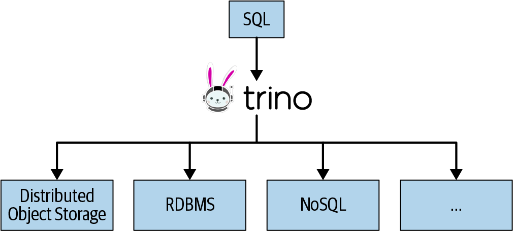
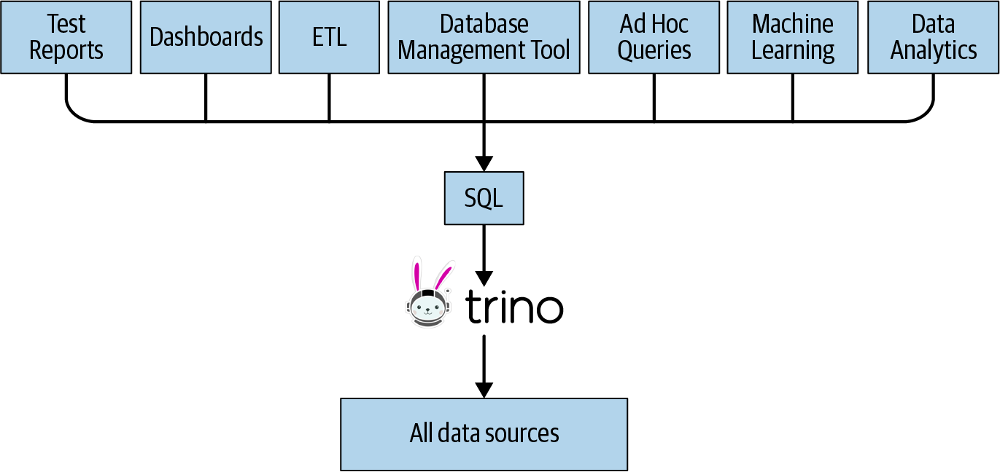

# Trino

## Overview

<p float="left">
    
    
</p>

* When organizations find the need to better understand and analyze data in their numerous RDBMSs, the creation and maintenance of `data warehouse` systems comes into play. Select data from various systems is then going through complex `ETL processes` and, often via long-running `batch jobs`, ends up in a tightly controlled, massive data warehouse.
* Trino, on the other hand, can be used as a `virtual data warehouse`. It can be used to define your semantic layer by using one tool and standard ANSI SQL. Once all the databases are configured as `data sources` in Trino, you can query them. This allows Trino to `scale up and down its compute resources` for query processing, based on analytics demand to access this data. 
* Trino represents the `compute layer`, whereas the underlying `data sources` represent the `storage layer`.

## Installation

1. Download `trino-server` from https://repo.maven.apache.org/maven2/io/trino/trino-server/:
```bash
wget https://repo.maven.apache.org/maven2/io/trino/trino-server/390/trino-server-390.tar.gz
tar xvzf trino-server-390.tar.gz
```

2. Check whether the `etc` folder contains the following configurations: `jvm.config`, `config.properties`, `node.properties` and `catalog/tpch.properties`. References are [Deploying Trino](https://trino.io/docs/current/installation/deployment.html) and [TPCH connector](https://trino.io/docs/current/connector/tpch.html).

3. Check whether `java -version` is above `17`.

4. Start `trino-server`:
```bash
/bin/launcher run
```

5. Download `trino-cli` from https://repo.maven.apache.org/maven2/io/trino/trino-cli/:
```bash
wget -O trino https://repo.maven.apache.org/maven2/io/trino/trino-cli/390/trino-cli-390-executable.jar

chmod +x trino
mv trino /usr/local/bin

trino --version
Trino CLI 390

trino
trino> SHOW CATALOGS;
 Catalog 
---------
 system  
 tpch    
(2 rows)

trino> SHOW SCHEMAS FROM tpch;
       Schema       
--------------------
 information_schema 
 sf1                
 sf100              
 sf1000
 
trino> SHOW TABLES FROM tpch.sf1;
 Table   
----------
 customer 
 lineitem 
 nation   
 orders  
 
trino --catalog tpch --schema sf1 --execute "SELECT nationkey, name, regionkey FROM nation LIMIT 5"
"0","ALGERIA","0"
"1","ARGENTINA","1"
"2","BRAZIL","1"
"3","CANADA","1"
"4","EGYPT","4"
```

6. View the `trino` web UI from http://localhost:8080/ui/.

## Architecture

<p float="left">
    
</p>

* All communication and data transfer between clients, coordinator, and workers uses `REST-based` interactions over `HTTP`/`HTTPS`.
* The `discovery service` typically runs on the coordinator and allows workers to register to participate in the cluster.

## References

* https://trino.io/docs/current/installation.html
* https://mvnrepository.com/artifact/io.trino
* https://github.com/trinodb/trino-python-client